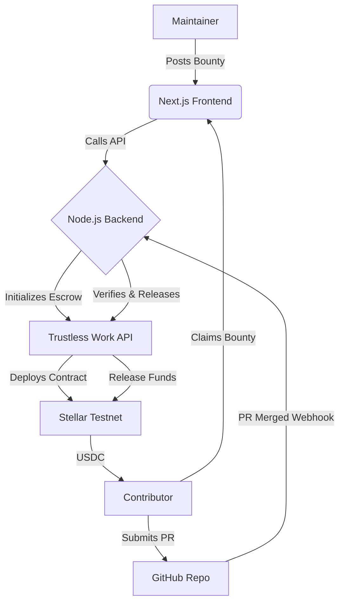

# 🏆 Stellar GitHub Bounty Board

<div align="center">
  
  
  
  
</div>
<br/>

> A decentralized, trustless platform for rewarding open-source contributions. Empower maintainers to fund issues via USDC on the Stellar Testnet, automatically releasing funds when a contributor's pull request is merged.

---

## 📑 Table of Contents
- [🌟 Key Features](#-key-features)
- [🛠️ Architecture](#️-architecture)
- [🚀 Getting Started](#-getting-started)
  - [Prerequisites](#prerequisites)
  - [Installation & Setup](#installation--setup)
- [⚓ Webhook Configuration](#-webhook-configuration)
- [🧰 Tech Stack](#-tech-stack)
- [🤝 Contributing](#-contributing)
- [📄 License](#-license)

---

## 🌟 Key Features

- **Trustless Escrow**: Rewards are securely locked in on-chain escrow contracts utilizing the **Trustless Work** protocol on the Stellar Testnet.
- **Automated Payouts**: Native integration with GitHub Webhooks ensures funds are disbursed instantaneously when a qualifying Pull Request is merged.
- **Freighter Wallet Integration**: Seamlessly authenticate and transact using the Stellar Freighter wallet extension.
- **Real-time Tracking**: Comprehensive dashboard to monitor active, claimed, and successfully paid bounties.
- **Premium User Experience**: Designed with modern aesthetics—featuring a sleek, glassmorphism-inspired dark theme tailored for developers.

---

## 🛠️ Architecture




---

## 🚀 Getting Started

Follow these instructions to set up the project locally for development and testing.

### Prerequisites

Ensure you have the following installed and configured before proceeding:

- **Node.js** (v18.x or higher)
- **npm** or **yarn** package manager
- **[Freighter Wallet](https://www.freighter.app/)** extension installed in your web browser.
- A **GitHub Account** with admin access to a repository (for webhook configuration).

### Installation & Setup

#### 1. Backend (Webhook Server) Setup

Navigate to the backend directory and install dependencies:

```bash
cd webhook-server
npm install
```

Configure your environment variables by copying the example file:

```bash
cp .env.example .env
```

Populate the `.env` file with the required credentials:

```env
# Trustless Work API Key (https://trustlesswork.com)
TRUSTLESSWORK_API_KEY=your_api_key_here

# Secret for verifying GitHub webhook signatures
GITHUB_WEBHOOK_SECRET=your_secure_random_string

# Stellar testnet wallet secret (for fee payments/escrow operations)
STELLAR_SOURCE_SECRET=your_stellar_secret_key

# GitHub Personal Access Token (PAT) for API interactions
GITHUB_TOKEN=your_github_token
```

Start the development server:

```bash
npm run dev
```

#### 2. Frontend Application Setup

In a new terminal window, navigate to the root directory and install frontend dependencies:

```bash
npm install
```

Start the Next.js development server:

```bash
npm run dev
```

The application will now be accessible at [http://localhost:3000](http://localhost:3000).

---

## ⚓ Webhook Configuration

For automated payouts to function, GitHub must be configured to notify the backend when Pull Requests are updated.

1. Navigate to your repository on GitHub.
2. Go to **Settings > Webhooks > Add webhook**.
3. Set the **Payload URL** to your backend's exposed endpoint (e.g., via `ngrok` for local development):
   `https://<your-ngrok-domain>.ngrok-free.app/webhook/github`
4. Set the **Content type** to `application/json`.
5. Enter the **Secret** (This must strictly match the `GITHUB_WEBHOOK_SECRET` in your `.env` file).
6. Under **Which events would you like to trigger this webhook?**, select **Let me select individual events**.
7. Check the box for **Pull requests**.
8. Ensure the PR body contains the text `Fixes #IssueNumber` or `Resolves #IssueNumber` so the backend can link it to the correct bounty.

---

## 🧰 Tech Stack

**Client-Side:**
- Framework: [Next.js 14](https://nextjs.org/)
- Library: [React](https://react.dev/)
- Styling: Custom Vanilla CSS (Design System)

**Server-Side:**
- Runtime: [Node.js](https://nodejs.org/)
- Framework: [Express](https://expressjs.com/)
- Database: [Better-SQLite3](https://github.com/WiseLibs/better-sqlite3)

**Blockchain & Infrastructure:**
- Network: [Stellar Testnet](https://stellar.org/)
- Escrow Protocol: [Trustless Work](https://trustlesswork.com/)
- Wallet Provider: `@stellar/freighter-api`

---

## 🤝 Contributing

We welcome contributions! To contribute to this project:

1. Fork the repository.
2. Create a new feature branch (`git checkout -b feature/amazing-feature`).
3. Commit your changes (`git commit -m 'Add some amazing feature'`).
4. Push to the branch (`git push origin feature/amazing-feature`).
5. Open a Pull Request.

Please ensure your code adheres to the existing style guidelines and passes any configured linting processes.

---

## 📄 License

Distributed under the MIT License. See `LICENSE` for more information.

---

<div align="center">
  Built with ❤️ for the Stellar Ecosystem
</div>
