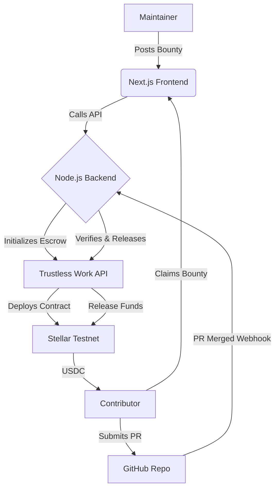

# 🏆 Stellar GitHub Bounty Board

A decentralized, trustless platform for rewarding open-source contributions. This project enables maintainers to post USDC bounties on GitHub issues, which are locked in Stellar escrow and automatically released to contributors when their pull requests are merged.

---

## 🌟 Key Features

- **Trustless Escrow**: Rewards are locked in on-chain escrow contracts using the **Trustless Work** protocol on Stellar Testnet.
- **Automated Payouts**: Integrated with GitHub Webhooks to release funds automatically the moment a qualifying Pull Request is merged.
- **Freighter Wallet Integration**: Seamlessly connect your Stellar wallet to post or claim bounties.
- **Real-time Tracking**: Dashboard to monitor open, claimed, and completed bounties with live stats.
- **Premium UI**: Modern, glassmorphism-inspired dark theme designed for a premium developer experience.

---


## 🛠️ Architecture



---

## 🚀 Getting Started

### Prerequisites

- **Node.js** (v18+ recommended)
- **Freighter Wallet** extension installed in your browser.
- A **GitHub Repository** where you have admin access to set up webhooks.

### 1. Backend Setup

```bash
cd webhook-server
npm install
cp .env.example .env
```

Edit the `.env` file with your credentials:
- `TRUSTLESSWORK_API_KEY`: Your API key from [Trustless Work](https://trustlesswork.com).
- `GITHUB_WEBHOOK_SECRET`: Optional fallback secret for older bounties. New bounties collect a GitHub webhook secret in the create form.
- `STELLAR_SOURCE_SECRET`: Your Stellar testnet wallet secret (for fee payments/escrow ops).
- `GITHUB_TOKEN`: Personal Access Token for GitHub API access.

Run the server:
```bash
npm run dev
```

### 2. Frontend Setup

In the root directory:

```bash
npm install
npm run dev
```

The application will be available at `http://localhost:3000/bounties`.

---

## ⚓ Webhook Configuration

To enable automated payouts, add a webhook to the GitHub repository that owns the issue:

1. Go to **Settings > Webhooks > Add webhook**.
2. **Payload URL**: `https://your-backend-domain.com/webhook/github`
3. **Content type**: `application/json`
4. **Secret**: Use the same secret you enter when posting the bounty.
5. **Which events**: Select **Let me select individual events** and check **Pull requests**.
6. Ensure the PR body contains `Fixes #IssueNumber` to link it to a bounty.

Each bounty stores its own webhook secret, so different repositories can use different webhook secrets without changing backend code.

---

## 🧰 Tech Stack

- **Frontend**: Next.js 14, React, Vanilla CSS (Design System)
- **Backend**: Node.js, Express, Better-SQLite3
- **Blockchain**: Stellar Network, Trustless Work Protocol
- **Wallet**: @stellar/freighter-api

---

## 📄 License

This project is licensed under the MIT License.
 
